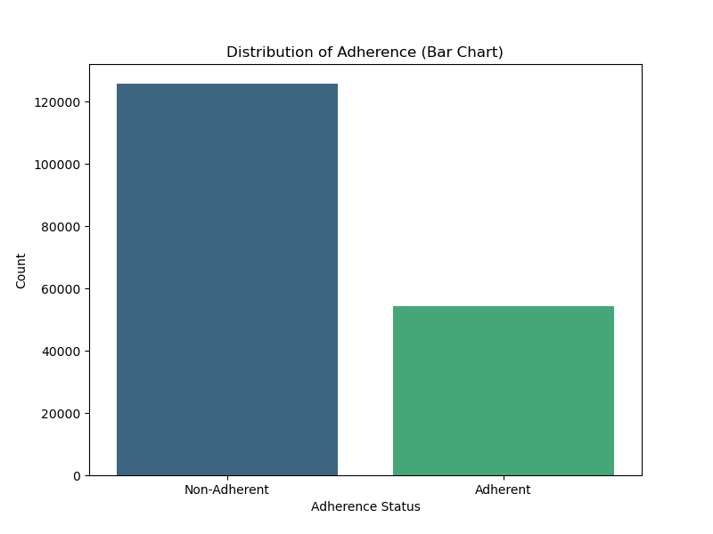
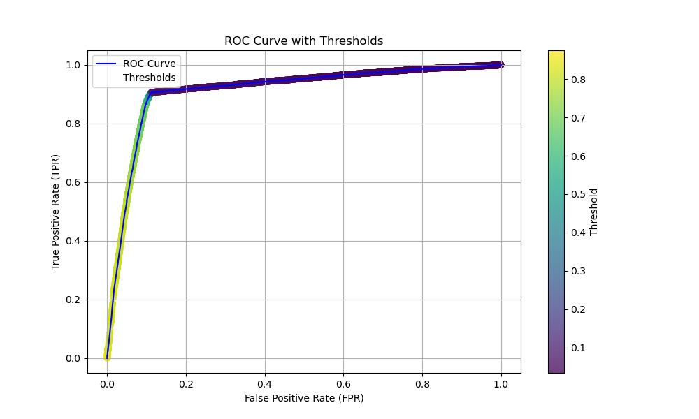
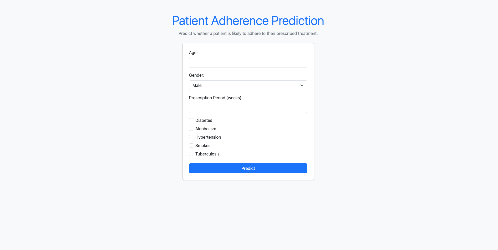

# Predicting Patient Adherence to Treatment Plans  

## **Project Overview**  
### **Objective**  
The goal of this project is to predict whether patients will adhere to their prescribed treatment plans based on various factors. By identifying at-risk patients early, healthcare providers can:  
- Improve patient outcomes.  
- Reduce healthcare costs.  
- Optimize resource allocation.  

### **Problem Statement**  
Non-adherence to treatment plans is a persistent and costly challenge in healthcare. Patients failing to follow their prescribed plans contribute to:  
- Worsened health outcomes.  
- Increased healthcare expenditures.  
- Unnecessary hospitalizations.  
This project aims to analyze contributing factors and leverage **predictive modeling** to aid healthcare professionals in improving patient compliance.  

## **Project Architectural Diagram**  
The architecture comprises the following steps:  


## **Dataset Structre**  
The dataset contains **180,000 observations** with the following features:  

| **Column Name**       | **Description**                                                |  
|------------------------|---------------------------------------------------------------|  
| `patient_id`          | Unique identifier for each patient.                           |  
| `Age`                 | Age of the patient (numerical).                                |  
| `Gender`              | Gender of the patient (Male or Female).                       |  
| `Prescription_period` | Duration of the prescription in days.                         |  
| `Diabetes`            | Binary indicator (1 for diabetes, 0 otherwise).              |  
| `Alcoholism`          | Binary indicator (1 for alcoholism, 0 otherwise).            |  
| `HyperTension`        | Binary indicator (1 for hypertension, 0 otherwise).          |  
| `Smokes`              | Binary indicator (1 for smoking, 0 otherwise).               |  
| `Tuberculosis`        | Binary indicator (1 for tuberculosis, 0 otherwise).          |  
| `Sms_Reminder`        | Binary indicator (1 if the patient received an SMS reminder, 0 otherwise). |  
| `Adherence`           | Binary target variable (1 for adherence, 0 for non-adherence). |  


## **Adherence (Target) Distribution**  


The data is not significantly imbalanced:
- **Non-Adherence**: Approximately 69%
- **Adherence**: Approximately 31%

Typically, imbalance-handling techniques are applied when one class constitutes only 10–20% of the data compared to the other. Since the class distribution in our dataset does not fall into this range, we will not apply any imbalance-handling techniques for now.

## **Model Training and Evaluation Metrics**  
### **Trained Models**  
- Logistic Regression  
- Decision Tree
- Random Forest
- Catboost
- XGBoost 

### **Evaluation Metrics**  
- **Accuracy**: Measures overall correctness of predictions.  
- **Precision**: Focus on the proportion of positive identifications that were correct.  
- **Recall**: Captures the ability of the model to find all relevant cases.  
- **F1-Score**: Harmonic mean of Precision and Recall.  

<table>
  <thead>
    <tr>
      <th>Model</th>
      <th>AUC_ROC</th>
      <th>F1_Score</th>
      <th>Accuracy</th>
      <th>Precision</th>
      <th>Recall</th>
    </tr>
  </thead>
  <tbody>
    <tr>
      <td>Logistic Regression</td>
      <td style="background-color: #ffcccc;">0.902175</td>
      <td style="background-color: #ffcccc;">0.804611</td>
      <td style="background-color: #ffcccc;">0.879288</td>
      <td style="background-color: #ccffcc;">0.783959</td>
      <td style="background-color: #ffcccc;">0.826381</td>
    </tr>
    <tr>
      <td>Decision Tree</td>
      <td>0.911181</td>
      <td>0.834555</td>
      <td>0.893281</td>
      <td>0.781818</td>
      <td>0.894922</td>
    </tr>
    <tr>
      <td>Random Forest</td>
      <td>0.911965</td>
      <td style="background-color: #ccffcc;">0.835184</td>
      <td>0.893448</td>
      <td style="background-color: #ffcccc;">0.780880</td>
      <td style="background-color: #ccffcc;">0.897604</td>
    </tr>
    <tr>
      <td>Catboost</td>
      <td style="background-color: #ccffcc;">0.912079</td>
      <td>0.834750</td>
      <td style="background-color: #ccffcc;">0.893476</td>
      <td>0.782443</td>
      <td>0.894552</td>
    </tr>
    <tr>
      <td>XGBoost</td>
      <td>0.911148</td>
      <td>0.834217</td>
      <td>0.893031</td>
      <td>0.781295</td>
      <td>0.894829</td>
    </tr>
  </tbody>
</table>

The `Random Forest` model was selected based on its ability to maximize recall, minimize false negatives, and achieve competitive performance while being efficient in terms of computational resources and latency.

#### **Key Reasons for Choosing Random Forest:**

- **Resource Efficiency**: RF performs well with limited computational resources and is faster to train compared to models like CatBoost.
- **Latency**: RF provides low-latency predictions, making it suitable for real-time applications.
- **Performance**: RF achieved the second-highest AUC score, balancing recall and precision effectively.

## Choosing Appropriate Threshold for Predictions using ROC Curve of Random Forest



### Threshold Selection:

Based on the ROC curve, the threshold of **0.69** was chosen, as it corresponds to the elbow point on the curve.

At this threshold:
- **True Positive Rate (TPR)**: 0.815928, meaning that 81.59% of positive cases are correctly identified.
- **False Positive Rate (FPR)**: 0.089679, which represents a 8.97% rate of false positives.

This threshold provides a strong recall while keeping false positives at an acceptable level. It is an ideal choice for this application, where false negatives (missed cases) could lead to serious consequences, such as hospitalizations.


 
## **Reproducibility**  
### **Local Environment**    
- Run the following commands to replicate locally:  
  ```bash  
  git clone https://github.com/PhikoSamka/Medication-Adherence.git  
  cd medication-adherence  
- Build the docker image
   ```bash
  docker build -t adherence-app .
- Run the image 
   ```bash
  docker run -p 9696:9696 adherence-app
- Access the app in a browser at http://localhost:9696. Below is what the UI should look like:


### Testing the application
To test the application, use the following input values:

- `'age'`: `65`
- `'prescription_period'`: `15`
- `'alcoholism'`: `No (uncheck)`
- `'hypertension`': `Yes (check)`
- '`smokes'`: `Yes (check)`
- The output should look like:
   **"The Patient is likely to adhere to medication"**

---
### **Cloud Environment**   
[In progress]


## Conclusion
This project demonstrates the development of a predictive model to assess patient adherence to treatment plans, using various machine learning algorithms. By employing Random Forest due to its ability to optimize recall and handle imbalanced datasets, the project successfully identifies at-risk patients, which can lead to improved healthcare outcomes.

The steps outlined for setting up the application locally, along with the detailed instructions for testing and evaluating the model, ensure that the project can be easily reproduced and utilized in real-world healthcare applications. By leveraging tools like Docker for easy deployment and AWS for cloud scalability, the project is adaptable for various environments, providing a robust solution for predicting patient adherence.

Overall, this work aims to contribute to the broader goal of improving patient compliance with treatment plans, thereby reducing healthcare costs and improving patient care.
